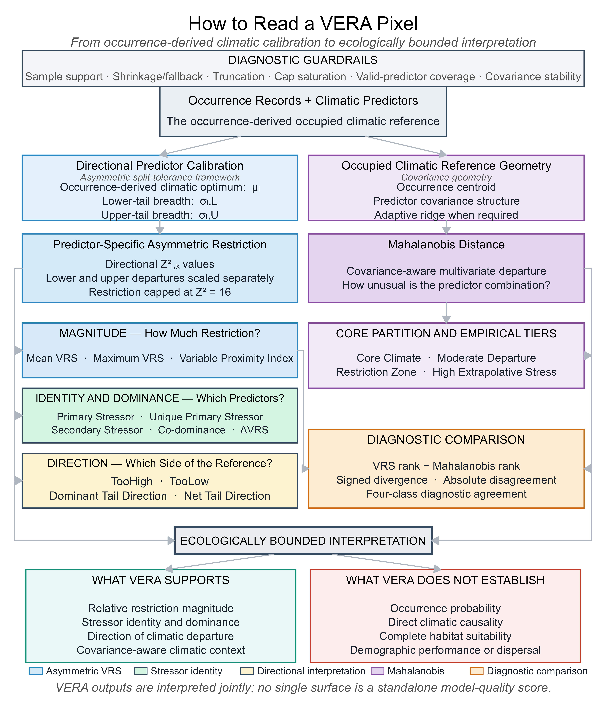
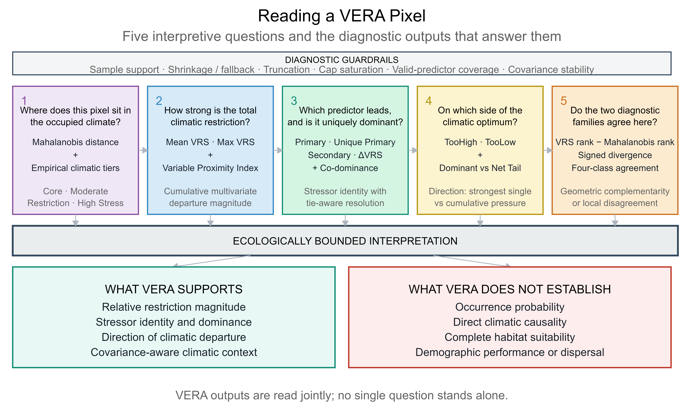

# VERA: Variable Ecological Restriction Analysis

**VERA** is an occurrence-calibrated framework for mapping climatic departure
from a species' occupied environmental reference. It separates five questions
that are often compressed into a single surface:

- Where does a pixel sit relative to the occupied climatic reference?
- How strong is its climatic departure?
- Which predictor carries the leading signal, and is that lead unique?
- Does the departure arise above or below the reference?
- Do directional VRS and covariance-aware Mahalanobis geometry agree?

> **Interpretive boundary:** VERA is a diagnostic and hypothesis-generating
> framework. It does not estimate occurrence probability, habitat suitability,
> physiological tolerance, demographic performance or causal range limitation.

## Project links

| Resource | Link |
|---|---|
| Illustrated tutorial | **[Open the complete *Sitta krueperi* tutorial](https://gok-wolf.github.io/VERA-climate-diagnostics/tutorial.html)** |
| Documentation website | [Open the VERA website](https://gok-wolf.github.io/VERA-climate-diagnostics/) |
| Scientific contact | [botanical24@gmail.com](mailto:botanical24@gmail.com) |

## Explore the illustrated tutorial

The complete worked example uses *Sitta krueperi* (Krüper's nuthatch) and covers
occurrence preparation, 19- and 36-predictor analyses, asymmetric calibration,
continuous climatic-departure surfaces, tie-aware attribution, directional
diagnostics and VRS–Mahalanobis comparison.

### ➡️ [OPEN THE ILLUSTRATED VERA TUTORIAL](https://gok-wolf.github.io/VERA-climate-diagnostics/tutorial.html)

The first guide shows how VERA's diagnostic families fit together. Click the
image to open the tutorial.

<p align="center">
  <a href="https://gok-wolf.github.io/VERA-climate-diagnostics/tutorial.html">
    
  </a>
</p>

The second guide reorganises the outputs around five questions asked when
reading an individual landscape pixel.

<p align="center">
  <a href="https://gok-wolf.github.io/VERA-climate-diagnostics/tutorial.html">
    
  </a>
</p>

## Tutorial workflow

```text
Climate rasters ──> WorldClim + ENVIREM predictor profiles
Occurrence data ──> domain cleaning ──> pixel-level thinning
                              │
                              v
                 independent 19- and 36-predictor VERA runs
                              │
                              v
             core outputs ──> directional and agreement add-ons
                              │
                              v
                    ecologically bounded interpretation
```

## Repository contents

| Script | Purpose |
|---|---|
| `scripts/01_envirem_generation.R` | Generates the retained ENVIREM climatic predictors. |
| `scripts/02_occurrence_preparation.R` | Applies the documented occurrence-preparation workflow. |
| `scripts/03_vera_19.R` | Runs the complete 19-predictor profile. |
| `scripts/04_vera_19_36.R` | Runs independent 19- and 36-predictor profiles. |
| `scripts/05_render_core_outputs.R` | Renders the core VERA output family. |
| `scripts/06_render_addons.R` | Renders directional and cross-geometry add-ons. |
| `scripts/07_vera_species_interpreter.R` | Generates evidence-bound species summaries, alerts, review products and paired profile-sensitivity outputs. |
| `scripts/08_render_mahalanobis_tiers.R` | Optionally renders occurrence-partition and Mahalanobis tier-calibration figures. |
| `scripts/09_render_response_curve_panels.R` | Optionally renders Top-6 native-unit density and asymmetric-transformation panels. |
| `scripts/10_render_top10_response_summaries.R` | Optionally renders Top-10 density and aligned-optimum ridge galleries. |

The 36-predictor profile contains 19 WorldClim bioclimatic variables and 17
continuous ENVIREM variables. The bounded discrete count
`monthCountByTemp10` is not included in this profile.

## Quick start

1. Review the input-data and path requirements in the tutorial.
2. Edit the user configuration block at the beginning of the selected script.
3. Run the paired tutorial:

```r
source("scripts/04_vera_19_36.R")
```

4. Render the completed outputs:

```r
source("scripts/05_render_core_outputs.R")
source("scripts/06_render_addons.R")
```

5. Generate the evidence-bound interpretation products:

```r
source("scripts/07_vera_species_interpreter.R")
```

6. Run optional publication renderers when required:

```r
source("scripts/08_render_mahalanobis_tiers.R")
source("scripts/09_render_response_curve_panels.R")
source("scripts/10_render_top10_response_summaries.R")
```

## Reproducibility and project status

This repository is under active development. Run-specific configuration,
session information, code checksums and output inventories are written by the
analysis pipeline. See `REPRODUCIBILITY.md`, `EXPECTED_OUTPUTS.md` and
`RELEASE_CHECKLIST.md` before preparing a release or archived dataset.

Manuscript citation details, a permanent repository DOI and final licensing
information will be added with the first formal release.

## Contact

Questions and scientific correspondence:
[botanical24@gmail.com](mailto:botanical24@gmail.com)

Issues and reproducibility reports may also be submitted through the repository
issue tracker.