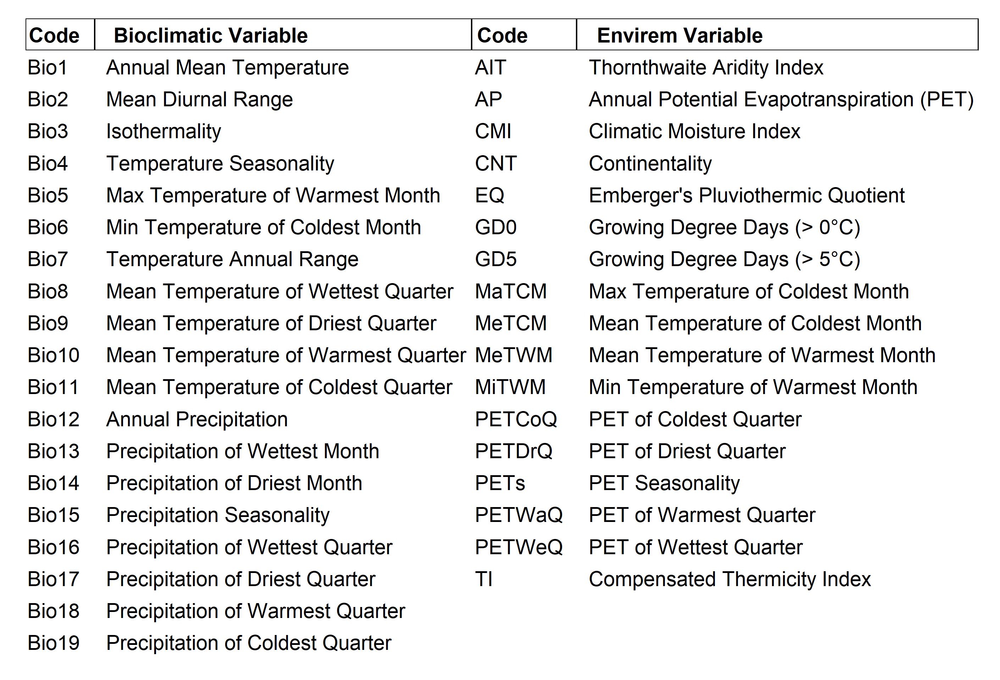
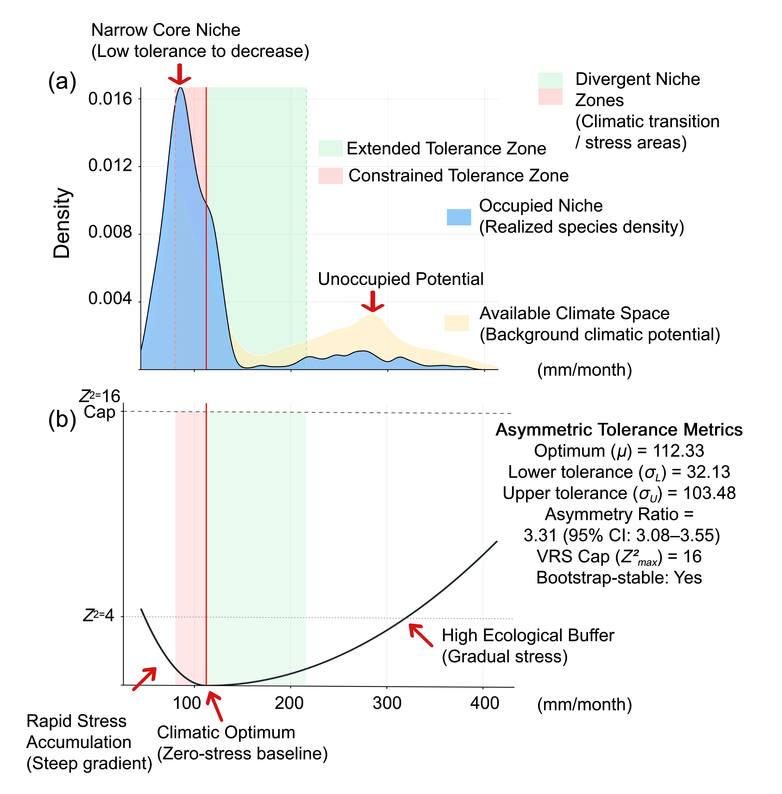
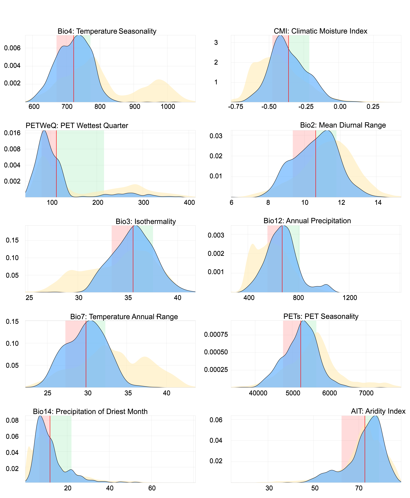
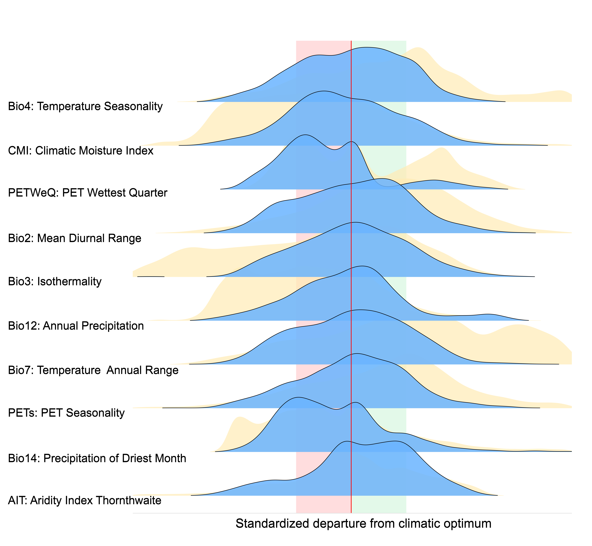
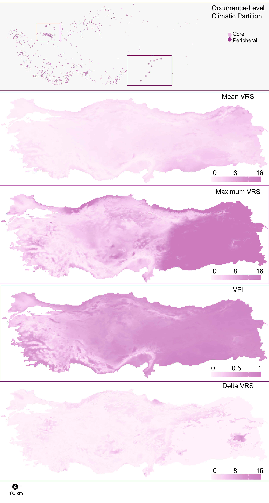
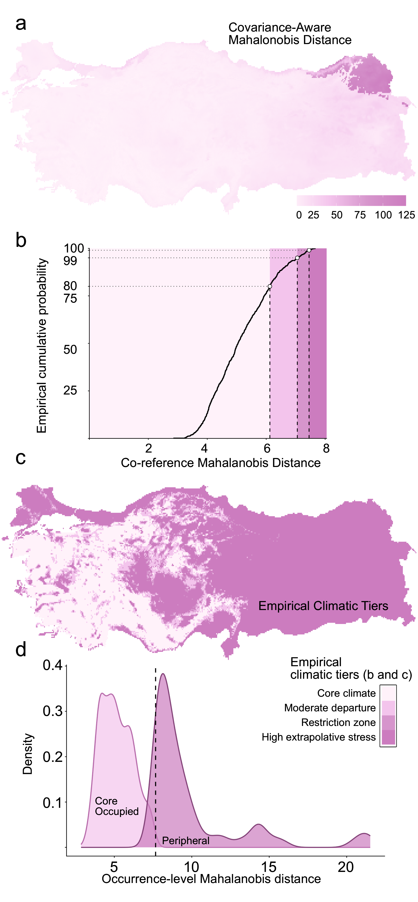
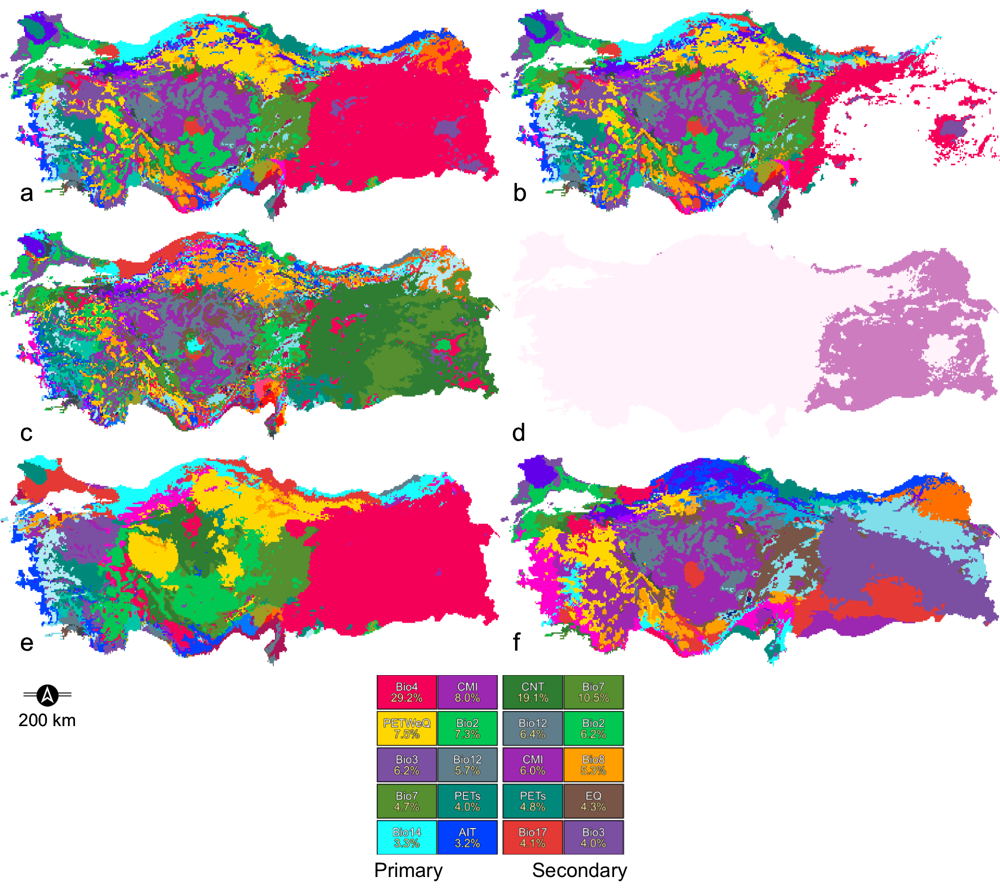
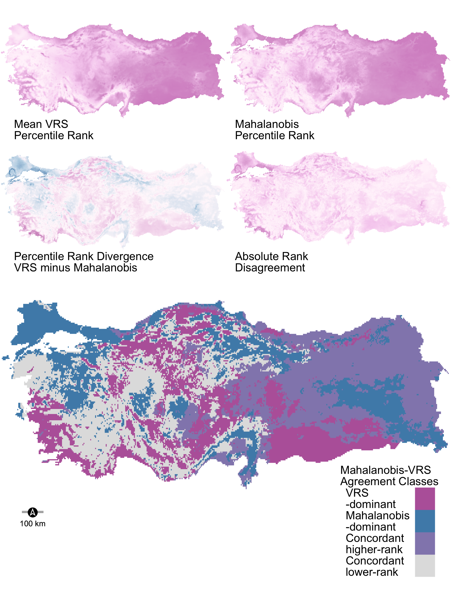
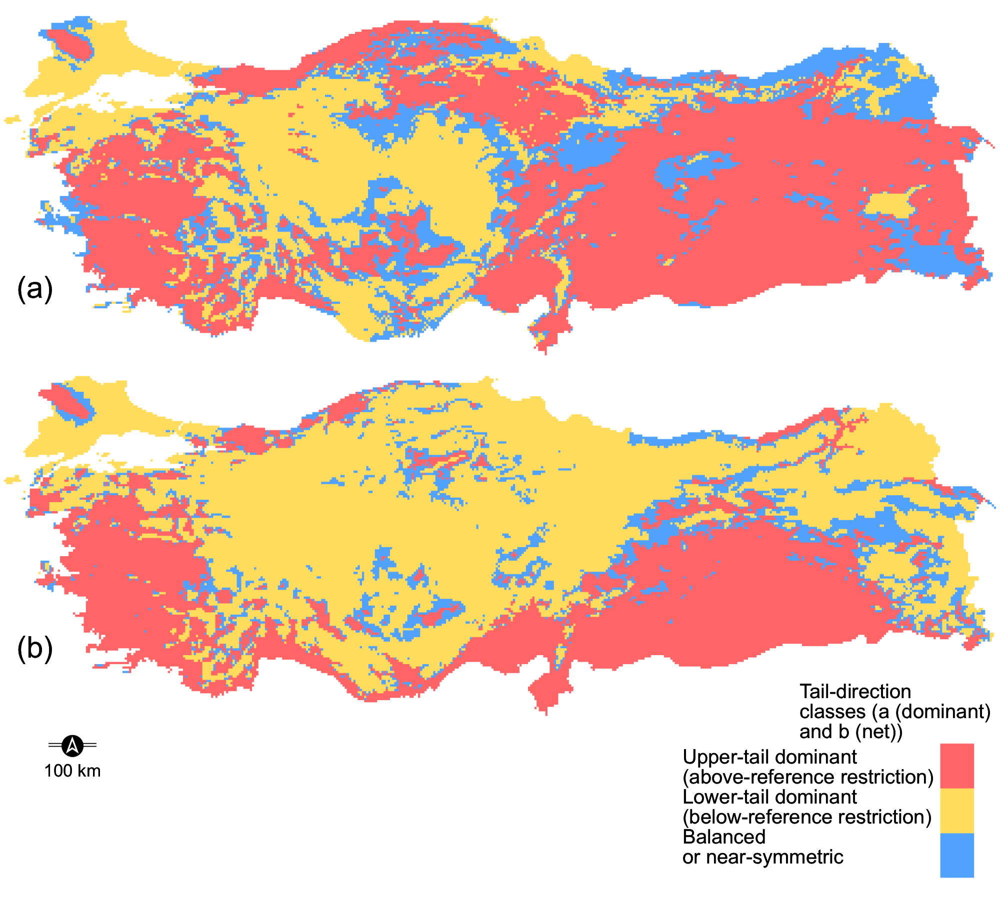
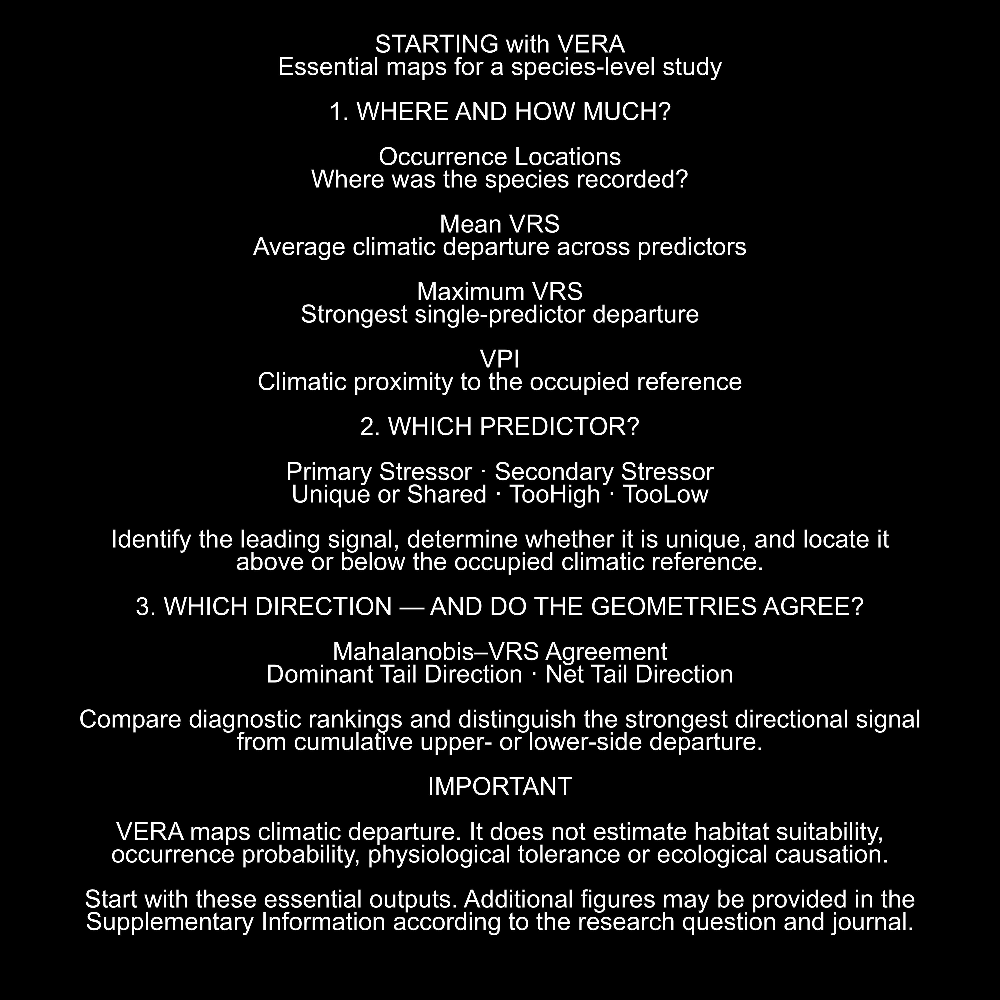

**Variable Ecological Restriction Analysis (VERA)** is an asymmetric climatic diagnostic framework. Species distribution models have greatly advanced the description and projection of species–environment relationships. VERA addresses a complementary question: **how strongly does each pixel depart from a species' occupied climatic reference, which predictor carries the leading signal, is that lead unique or shared, and does the departure arise above or below the reference?**

This repository contains the public tutorial pipeline: from climate rasters and occurrence preparation through the VERA core computation, spatial diagnostics and interpretation of the resulting outputs. The traceability table below identifies the associated scripts and output families.

> **Interpretive boundary.** VERA maps climatic departure from an occupied reference. It does not estimate occurrence probability, habitat suitability, physiological tolerance, demographic performance or causal range limitation.

The focal taxon throughout is *Sitta krueperi* (Krüper's Nuthatch), an eastern-Mediterranean forest species with a distribution largely restricted to Türkiye.

{fig-alt="VERA project banner showing the full name Variable Ecological Restriction Analysis on a black background." fig-align="center" width="65%"}

---

<a id="before-any-code-runs"></a>
## Before Any Code Runs: Why Occurrence Quality Matters

If you take one thing away from this tutorial, take this: **VERA's reference statistics are estimated directly from the retained occurrences, so occurrence quality must be evaluated before running the analysis.**

Occurrence errors and sampling bias matter in all distributional analyses. In VERA, their influence is especially transparent because every downstream output is built on three predictor-specific reference statistics estimated directly from the occurrence values:

- **μ** (mu) — the occurrence-derived reference centre
- **σ_L** — the lower-tail occupied climatic breadth
- **σ_U** — the upper-tail occupied climatic breadth

There is no discriminative learner between your points and these numbers. A wildly wrong occurrence:

- shifts **μ** toward the outlier's value,
- inflates the σ on whichever tail the outlier landed,
- warps the empirical VRS surface across the entire landscape,
- distorts the covariance matrix used for Mahalanobis calibration,
- and shifts the empirical 80 / 95 / 99 % percentile thresholds that define the four climatic tiers.

There is also a subtler failure mode. If occurrences remain strongly clustered near cities, roads, protected areas or intensively surveyed localities, **μ** and the tail breadths may partly reflect observation effort rather than the intended distribution of occupied climatic conditions. The pixel-level procedure below removes duplicate representation within individual raster cells, but it does not correct broader clustering among neighbouring cells. When such structure is suspected, researchers should evaluate additional distance-based thinning or another sampling-bias correction at a scale justified by the data, predictor resolution and research question, and report a sensitivity analysis rather than assuming that more aggressive thinning is always preferable ([Aiello-Lammens et al., 2015](https://doi.org/10.1111/ecog.01132)).

For these reasons, the tutorial documents a three-step preprocessing cascade before VERA is invoked. These are explicit choices for this worked example; other datasets may require additional or alternative taxonomic, spatial and sampling-bias controls.

> **The rule:** preprocessing decisions define the empirical occupied reference and must therefore be justified, recorded and sensitivity-checked.

---

<a id="repository-layout"></a>
## Repository Layout

```
scripts/
├── 01_envirem_generation.R          # Build 17 ENVIREM predictors from monthly climate
├── 02_occurrence_preparation.R      # Three-step occurrence cleaning cascade
├── 03_vera_19.R                     # Convenience: 19-predictor VERA run only
├── 04_vera_19_36.R                  # Canonical: dual 19- and 36-predictor VERA
├── 05_render_core_outputs.R         # CORE renderer — spatial and per-variable diagnostics
└── 06_render_addons.R               # ADD-ON renderer — agreement + tail-direction diagnostics
```

The scripts are numbered to reflect execution order. `04_vera_19_36.R` is the canonical implementation; `03_vera_19.R` is a convenience version for users who only need the classical 19 bioclimatic predictors. Both write outputs into `C:/VERA/Results/{19,36}/Skr_current/` using the exact same directory structure, so downstream renderers work identically on either result.

The renderer scripts (`05`, `06`) consume completed VERA outputs and do not modify any core diagnostic. They can be re-run at any time without recomputing the analysis.

---

<a id="stage-1"></a>
## Stage 1 — Building the Predictor Stack (ENVIREM)

**Script:** `01_envirem_generation.R`

VERA can run on the classical 19 [WorldClim bioclimatic variables](https://www.worldclim.org/data/bioclim.html) alone, but the canonical *Sitta krueperi* analysis uses a 36-predictor stack: the 19 bioclimatics plus 17 [ENVIREM](https://envirem.github.io/) extended variables.

This first script builds the 17 ENVIREM rasters from monthly climate inputs (`prec_XX`, `tmin_XX`, `tmax_XX`, `tavg_XX` for months 01–12) using the `envirem` R package. Solar radiation is derived internally for year 2000.

The `envirem` package can generate 18 climatic variables under the configuration used here. VERA retains 17 of them. `monthCountByTemp10` — the number of months with mean temperature above 10 °C — is excluded because it is a bounded discrete count rather than a continuous climatic predictor. This is a predictor-set design choice, not a claim that the variable lacks ecological relevance. The inventory below lists the complete 36-predictor profile used in this tutorial.

{fig-alt="Table listing the codes and names of 19 WorldClim bioclimatic variables and 17 ENVIREM variables used by VERA." fig-align="center" width="100%"}

> **Requirement.** All monthly rasters must have matching geometry, resolution, CRS and extent. VERA's raster validator will reject a stack with mismatched geometries.

---

<a id="stage-2"></a>
## Stage 2 — The Three-Step Occurrence Cascade

**Script:** `02_occurrence_preparation.R`

This script operationalises the occurrence-preparation choices used in the tutorial. The three stages are applied in the documented order so that their effects on record retention remain auditable.

### Stage 2.1 — Domain cleaning

Points are converted to a `SpatVector`, projected to the predictor stack's CRS, and used to extract Bio1 values. Any point whose extraction returns `NA` (i.e., falls outside the valid raster footprint or into a masked cell) is dropped.

**What this catches.** Points in the sea, on nodata cells, or beyond the raster envelope. These would silently drop out of the anchor computation as incomplete rows anyway, but removing them here makes the point count honest from the very first step and preserves the traceability of every dropped record.

### Stage 2.2 — Pixel-level thinning

For each retained occurrence, the raster cell number is computed via `cellFromXY`. Records that share a cell are deduplicated so that at most **one occurrence per raster cell** survives.

**What this catches — and why it matters for VERA.** Pixel-level thinning reduces the influence of uneven sampling effort on the reference statistics. If a single 2.5-arc-minute cell contains twelve overlapping records, its climate would otherwise receive twelve times the weight of a cell represented by one record. Pixel thinning therefore enforces "one raster cell, one vote" at the analysis resolution.

Unlike distance-based spatial thinning, pixel-level thinning is matched to the raster resolution being analysed. It is one defensible choice when the raster cell is the intended unit of environmental duplication, although residual sampling bias may still require additional treatment.

### Stage 2.3 — Geographic outlier isolation (retain 97 %)

The thinned points are projected to a metric CRS (EPSG:3857), a geographic Mahalanobis distance is computed from the point cloud's spatial centroid and covariance, and the top 3 % most-distant points are removed. The remaining 97 % becomes the final occurrence table used by VERA.

**What this screens.** The rule isolates the most geographically distant records for exclusion under the tutorial protocol. Such records may include coordinate errors, imprecise georeferences or genuine peripheral observations; distance alone cannot distinguish among these possibilities. Source-level review should be used whenever record provenance is available.

Why 3 %? In this tutorial it is an explicitly documented screening rule for the most geographically isolated records. It is not a universal VERA default and should not replace taxonomic, coordinate or source-level validation. The later climatic core/peripheral partition (see [Figure 4](#figure-4)) answers a different question because it is based on environmental rather than geographic distance.

> **The full cascade.** The tutorial records the number of observations retained at every step. These counts are dataset-specific and should be reported as an audit trail, not treated as expected retention targets for other taxa.

The final table lands at `C:/VERA/Occurrences/Edited/Sitta_krueperi.csv` and is the *only* occurrence input consumed by the VERA scripts that follow.

---

<a id="stage-3"></a>
## Stage 3 — Running the VERA Core Pipeline

**Scripts:** `03_vera_19.R` (convenience, 19 predictors) and `04_vera_19_36.R` (canonical, 19 + 36 predictors in the same run).

Most users should start with `04_vera_19_36.R`. It runs the same focal taxon under both the 19-predictor and 36-predictor profiles in a single pass, writing outputs into two parallel result trees:

```
C:/VERA/Results/19/Skr_current/
C:/VERA/Results/36/Skr_current/
```

Both trees have identical internal structure, so any renderer script works on either without modification. `03_vera_19.R` exists purely for users whose research question requires only the 19 classical bioclimatics — it is a strict subset of what `04_vera_19_36.R` does.

Internally, each VERA run performs the following steps for the focal taxon:

1. Reads the cleaned occurrence table and extracts predictor values at each point.
2. For every predictor, estimates the asymmetric anchor triple **(μ, σ_L, σ_U)** with shrinkage of small-sample tail scales toward the global occurrence SD, a bootstrap-stability check on the asymmetry ratio σ_U / σ_L, and a background-truncation diagnostic.
3. Partitions occurrences into a **climatic core** and a **peripheral** set using the covariance-aware Mahalanobis distance and a 0.90 quantile rule.
4. Computes the per-pixel VRS surfaces: **mean VRS**, **max VRS**, **Δ VRS**, primary / secondary / TooHigh / TooLow stressor identity rasters, co-dominance counts.
5. Computes the covariance-aware **Mahalanobis distance** raster and derives empirical **80 / 95 / 99 % tier thresholds** from the core occurrences.
6. Runs Add-On 01 (tail direction) and Add-On 02 (VRS vs Mahalanobis rank agreement).
7. Writes a machine-readable manifest, session info, code MD5 checksum, and full output inventory.

The result is a single directory tree containing everything the renderer scripts need. No further computation happens after Stage 3.

---

<a id="how-vera-outputs-fit-together"></a>
## How the VERA Outputs Fit Together

Before examining individual maps, it helps to see the diagnostic architecture as a whole. The same occurrence-derived climatic reference feeds two complementary branches. The directional VRS branch separates magnitude, predictor identity and tail direction. The Mahalanobis branch describes covariance-aware multivariate departure and supplies the empirical climatic partition. Their percentile ranks are then compared to localise agreement and divergence.

The guardrail band at the top of the diagram is part of the interpretation rather than an optional appendix. Sample support, tail fallback, background truncation, cap saturation, valid-predictor coverage and covariance stability determine how confidently each output can be read. The lower boxes preserve the central boundary: VERA supports climatic-departure hypotheses, but it does not establish occurrence probability, complete habitat suitability, demographic performance, dispersal or direct climatic causality.

{fig-alt="Flow diagram connecting occurrences and climatic predictors to directional VRS, Mahalanobis distance, magnitude, stressor identity, direction, diagnostic comparison and bounded interpretation." fig-align="center" width="90%"}

> **Terminology note.** Where a diagram uses *climatic optimum*, it refers to the occurrence-derived reference centre used for calibration. It is not an experimentally estimated physiological optimum.

---

<a id="stage-4"></a>
## Stage 4 — Rendering the Diagnostic Outputs

**Scripts:** `05_render_core_outputs.R`, `06_render_addons.R`.

The renderers consume the finished VERA outputs and translate the completed CSV and GeoTIFF products into publication-grade visualisations. They do not change the underlying diagnostic calculations.

Each renderer loops internally through both the 19- and 36-predictor result trees, so a single execution populates two parallel image directories:

```
C:/VERA/Results/19/Images/{core_renderer_plum, addon_renderer_plum}/
C:/VERA/Results/36/Images/{core_renderer_plum, addon_renderer_plum}/
```

Missing result trees are skipped silently — running the renderers on a 19-only setup produces only the 19-profile images.

---

<a id="reading-the-outputs"></a>
## Reading the Outputs — Guided Figure Tour

The practical reading guide below reorganises VERA around five questions asked at a pixel. It is a recommended interpretation order, not the internal computational order of the pipeline: first establish covariance-aware climatic context; then read restriction magnitude; resolve predictor identity and uniqueness; determine direction relative to the reference; and finally examine agreement between VRS and Mahalanobis geometry.

{fig-alt="Five-column guide asking where a pixel sits in occupied climate, how strong restriction is, which predictor leads, which side of the reference dominates and whether VRS and Mahalanobis agree." fig-align="center" width="100%"}

The eight worked outputs that follow move from calibration to spatial interpretation. The first examples introduce and compare asymmetric predictor-level geometry; the subsequent maps describe continuous departure, covariance-aware context, attribution, direction and cross-geometry agreement.

---

<a id="figure-1"></a>
### Figure 1 — The VERA Conceptual Framework

{fig-alt="Conceptual VERA figure showing occupied and background climatic distributions and an asymmetric restriction curve."}

This two-panel figure is the conceptual foundation for everything else. Both panels use a single predictor — **PET of the Wettest Quarter (PETWeQ)** — to make the asymmetric restriction geometry visible in native units.

**Panel (a) — The observable niche.** The blue density is the species' realised distribution along PETWeQ (the *Occupied Niche*). The yellow density is the region-wide availability of PETWeQ values (the *Available Climate Space*). The narrow blue peak sits on the low end of the gradient; the yellow density has a broad secondary peak far to the right where PETWeQ values reach 250–350 mm/month.

That right-hand yellow peak represents climatic conditions available within the supplied background domain but weakly represented among the retained occurrences. This contrast generates a directional restriction hypothesis. It does not by itself demonstrate accessibility, physiological exclusion or the causal process responsible for the spatial pattern.

The two shaded zones visualise the asymmetric occupied breadths. The **red lower-tail zone** spans μ − σ_L to μ, and the **green upper-tail zone** spans μ to μ + σ_U. These occurrence-derived intervals describe the calibration data; they are not experimental tolerance limits.

**Panel (b) — The restriction gradient.** Panel (b) transforms Panel (a) into the machinery VERA actually computes. The x-axis is the same (PETWeQ in mm/month) but the y-axis is now the per-pixel **Z²** value — the squared, asymmetric, capped restriction score contributed by this variable alone.

The curve is deliberately asymmetric. On the left side of μ, Z² rises steeply as PETWeQ decreases because the estimated lower-tail occupied breadth is narrow. On the right side, Z² rises more gradually because the upper-tail breadth is wider. This is directional scaling of climatic departure, not a fitted performance response.

The **Z² = 16 cap** is the canonical ceiling used in this tutorial to prevent extrapolative values from dominating multivariate summaries. The **Z² = 4** line is a visual reference in this educational figure, not an independently calibrated ecological threshold.

**The reported asymmetry metrics** (μ = 112.33, σ_L = 32.13, σ_U = 103.48) give an asymmetry ratio of **3.31** with a 95 % bootstrap CI of 3.08–3.55 and the *bootstrap-stable* flag = Yes. This indicates that the estimated directional breadth contrast was stable under the specified occurrence-resampling procedure; it is not evidence of a physiological response curve.

> **What Figure 1 teaches you.** Every subsequent figure in this tutorial is built out of this asymmetric geometry, one predictor at a time, then summed, projected across the landscape, and cross-attributed. Understand Panel (a) and Panel (b), and every downstream figure becomes readable.

---

<a id="figure-2"></a>
### Figure 2 — Per-Variable Niches in Native Units

{fig-alt="Ten predictor panels comparing occupied and background climatic distributions in native units."}

Figure 2 replicates Panel (a) of Figure 1 for the **ten most frequent Primary Stressor classes** in the mapped domain. Each panel keeps the predictor's native units on the x-axis, so the occurrence-derived reference and breadths can be read in their original measurement scales.

For every panel:

- **Blue** density = species' occupied climate (occurrences),
- **Yellow** density = climatic distribution in the supplied background domain,
- **Red-shaded band** = μ − σ_L to μ (Constrained Tolerance Zone),
- **Green-shaded band** = μ to μ + σ_U (Extended Tolerance Zone),
- **Red vertical line** = occurrence-derived reference centre μ.

Reading this figure means asking the same three questions of each panel. **First**, does the occupied distribution match, only partly overlap or occupy a narrow subset of the supplied background? **Second**, is the lower occupied breadth narrower than the upper breadth, or vice versa? **Third**, does the occurrence density end sharply or taper gradually near either edge? These are descriptive patterns that can motivate physiological, demographic or biotic hypotheses for independent testing.

The panels reveal several descriptive patterns: relatively narrow lower occupied breadths for some predictors, broader overlap between occurrences and background for others, and cases in which the occurrence density approaches an edge of the supplied background distribution. These contrasts help identify predictor-specific hypotheses for further study.

---

<a id="figure-3"></a>
### Figure 3 — Aligned-Optimum Cross-Variable Comparison

{fig-alt="Standardised ridge distributions aligned at the occurrence-derived reference centre for cross-predictor comparison."}

Figure 2 shows each predictor in its own units, which is faithful but makes cross-variable comparison hard: a 30-mm departure in Bio14 and a 100-unit departure in PETs are not directly comparable. Figure 3 fixes this by standardising every predictor against its own asymmetric anchor:

- Values below μ are rescaled by σ_L (so one lower-tail occupied breadth sits at z = −1),
- Values above μ are rescaled by σ_U (so one upper-tail occupied breadth sits at z = +1),
- The occurrence-derived reference centre always sits at z = 0.

This is the *same* standardisation VERA uses internally to compute Z². The x-axis is therefore not an arbitrary rescaling — it is the exact restriction-score coordinate.

With every μ aligned at zero, the **central red vertical line** is the shared reference centre. The bands from −1 to 0 and from 0 to +1 represent one estimated lower- and upper-tail occupied breadth, respectively.

Reading the ridges top-to-bottom, four ecological questions become answerable at a glance:

1. **Is the occupied distribution narrower or wider than the supplied background?** This describes environmental occupancy relative to the selected domain; it does not alone establish ecological specialisation.
2. **Where does the occupied density peak relative to the reference line?** A shift indicates asymmetric occurrence density around the arithmetic mean.
3. **How far do occupied and background values extend beyond ±1?** This shows their positions relative to the estimated tail-specific occupied breadths.
4. **Does the background distribution extend far beyond the occupied distribution on one side?** This identifies directional contrast relative to the selected study domain.

Together Figures 2 and 3 form a matched pair: Figure 2 preserves native measurement units, while Figure 3 enables cross-predictor comparison in standardised directional units.

---

<a id="figure-4"></a>
### Figure 4 — Core Spatial Outputs

{fig-alt="Maps of the occurrence partition, mean and maximum VRS, VPI and delta VRS."}

Figure 4 is the first spatial output of the pipeline. It stacks five maps of Türkiye, each showing a different facet of the species' climatic geography.

**Panel 1 — Occurrence-Level Climatic Partition.** Every retained occurrence is classified as **Core** (light pink) or **Peripheral** (dark purple) using its multivariate Mahalanobis distance and the 0.90 empirical quantile rule. The mapped proximity of some Core and Peripheral records shows that climatic position need not mirror geographic separation. In this topographically complex domain, that pattern is consistent with environmental heterogeneity over short distances, although the map alone does not identify its cause.

**Panel 2 — Mean VRS.** The pixel-wise mean of the Z² values across predictors. Low values indicate smaller average climatic departure from the occupied reference; high values indicate larger cumulative departure. Mean VRS does not measure physiological stress or fitness.

**Panel 3 — Maximum VRS.** For each pixel, this is the largest predictor-specific Z² value. It identifies the strongest single-axis departure signal even when the remaining predictors are closer to their occupied references. Compared with Mean VRS, it emphasises a Liebig-inspired candidate bottleneck rather than cumulative departure.

**Panel 4 — VPI (Variable Proximity Index).** Defined as VPI = 1 / (1 + mean VRS), this bounded inverse increases as mean VRS decreases. Values nearer 1 indicate greater climatic proximity to the occupied reference; values nearer 0 indicate greater average departure. VPI is not a habitat-suitability, occurrence-probability or habitat-quality index.

**Panel 5 — Δ VRS (Delta VRS).** This is a separation diagnostic: the difference between the largest and second-largest predictor-specific scores. Large values indicate a clearly separated leading score; small values indicate weak separation or a tie. It does not establish that manipulating the leading variable would alter occurrence or performance.

> **Reading rule.** Interpret each legend directly. Mean VRS, maximum VRS and VPI describe climatic departure or proximity, whereas Δ VRS describes separation between the two leading predictor scores. None is a map of habitat quality.

---

<a id="figure-5"></a>
### Figure 5 — Mahalanobis Distance and Empirical Climatic Tiers

{fig-alt="Mahalanobis distance map, empirical cumulative distribution, climatic tiers and occurrence-level distance densities."}

Figure 5 shows VERA's covariance-aware multivariate calibration. Where Figure 4 summarises restriction one variable at a time and then averages, Figure 5 treats all predictors *simultaneously* under their joint covariance structure.

**Panel (a) — Covariance-Aware Mahalanobis Distance.** For every pixel, the Mahalanobis distance to the occupied climatic centroid, computed with a regularised covariance matrix built from the actual occurrences. Light pixels are close to the multivariate niche core; dark pixels are far. Unlike VRS, this metric fully accounts for correlations between predictors — a pixel that is moderately warm and moderately dry is treated differently from a pixel that is moderately warm and moderately wet, even if both would have the same VRS.

**Panel (b) — Empirical Cumulative Probability.** This is the *calibration engine* that produces Panel (c). The curve is the empirical CDF of Mahalanobis distances at the core occurrences. Three horizontal reference lines mark the **80th, 95th, and 99th percentiles** of the core distribution. Their intersections with the CDF define three **empirical distance thresholds** — dashed vertical lines dropped from those intersections. These thresholds are not fixed; they are derived from the species' own occupied climate distribution, so the tier boundaries mean the same thing across any taxon: the boundary between "core climate" and "moderate departure" is always the distance beyond which only 20 % of core occurrences are found, and so on.

**Panel (c) — Empirical Climatic Tiers.** The thresholds from Panel (b) are applied to Panel (a), collapsing the continuous distance surface into four categorical zones:

- **Core climate** (lightest) — conditions within the first empirical distance band.
- **Moderate departure** — the next empirical distance band beyond the core.
- **Restriction zone** — larger covariance-aware departure from the reference.
- **High extrapolative stress** (darkest) — the most distant empirical tier in this diagnostic classification.

Because the thresholds come from each taxon's core occurrence distribution, tier labels have a consistent percentile-based interpretation when taxa use the same settings. Absolute distances and mapped areas remain taxon- and predictor-profile-specific.

**Panel (d) — Occurrence-level Mahalanobis density.** Every retained occurrence is scored by its Mahalanobis distance, and the density is displayed by the rule-based partition. The expected separation is a visual audit of how the empirical threshold divided the observations; it is not an independent validation of the partition.

> **What Figure 5 adds beyond Figure 4.** VRS is predictor-wise and directionally scaled; Mahalanobis distance is covariance-aware and directionally symmetric around its centre. Agreement indicates convergence between the two diagnostic geometries, while disagreement localises where their mathematical assumptions produce different rankings.

---

<a id="figure-6"></a>
### Figure 6 — Categorical Stressor Attribution

{fig-alt="Six maps showing primary, secondary, unique or co-dominant, TooHigh and TooLow stressor attribution."}

Figures 4 and 5 describe the magnitude of climatic departure and its covariance-aware context. Figure 6 reports the predictor identities associated with the leading and directional scores. Colours encode predictor classes rather than score intensity.

Six panels cover complementary attribution questions.

**Panel (a) — Primary Stressor.** For each pixel, this layer reports the predictor assigned to the largest Z² value after deterministic tie breaking. It is the leading climatic-departure signal, not a demonstrated causal limiting factor.

**Panel (b) — Secondary Stressor.** For each pixel, this is the predictor associated with the second-largest Z² value. It describes the local hierarchy of scores without implying the outcome of manipulating either predictor.

**Panel (c) — Alternate Primary View.** A companion primary-stressor view emphasising a different colour palette; the interpretation is identical to Panel (a).

**Panel (d) — Primary Stressor Uniqueness.** A diagnostic map with two categories.

- **Light pixels** — one predictor has a strict single maximum. The size of its lead should still be checked with Δ VRS.
- **Dark plum pixels** — two or more predictors share the maximum score. Cap saturation is a common source of such ties but should be verified with the cap-engagement diagnostics.

**Panel (e) — TooHigh Stressor.** Attributes the primary restriction *only where the variable exceeds μ*. Answers: "where is the environment *too much* for the species — too warm, too wet, too seasonal?"

**Panel (f) — TooLow Stressor.** Attributes the primary restriction *only where the variable falls below μ*. Answers: "where is the environment *insufficient* — too cool, too dry, too aseasonal?"

Comparing Panels (e) and (f) localises the direction of the leading predictor-wise departure relative to the occupied reference.

> **What Figure 6 adds.** VERA reports which predictor carries the leading score, whether that maximum is strict or shared, and whether the contributing value lies above or below the occupied reference. These are diagnostic attributions, not explanations of suitability or causation.

---

<a id="figure-7"></a>
### Figure 7 — Add-On Branch A: Metric-Agreement Diagnostic

{fig-alt="Maps of VRS and Mahalanobis ranks, signed and absolute disagreement, and four agreement classes."}

The two add-on branches step back from the primary diagnostic and cross-check VERA's outputs against each other and against alternative interpretations. **Branch A** compares VERA's asymmetric restriction signal (VRS) against the covariance-aware multivariate baseline (Mahalanobis).

The five panels form a strict derivation pipeline — each panel is derived from the ones above it. The first four are intermediate mathematical steps and are shown without individual legends because the story they tell together is what matters; the fifth panel is the categorical synthesis.

1. **Mean VRS Percentile Rank** — VERA's asymmetric restriction expressed as a landscape-relative percentile.
2. **Mahalanobis Percentile Rank** — the covariance-aware multivariate distance expressed the same way.
3. **Percentile Rank Divergence (VRS minus Mahalanobis)** — the signed difference. Purple / magenta pixels are places where VRS ranks the pixel more restrictive than Mahalanobis does; blue pixels are the reverse. Signs matter here — this map answers *which model calls this pixel worse*.
4. **Absolute Rank Disagreement** — the same difference stripped of sign. Answers *how far apart the two models are*, regardless of which is higher.
5. **Mahalanobis–VRS Agreement Classes (bottom panel)** — the categorical synthesis, with a proper legend.
   - **VRS-dominant** (magenta) — pixels where the VRS percentile rank exceeds the Mahalanobis rank by more than the configured divergence threshold. Directional predictor-wise scaling has greater influence here.
   - **Mahalanobis-dominant** (blue) — pixels where the Mahalanobis percentile rank exceeds the VRS rank by more than the threshold. Covariance-aware multivariate geometry has greater influence here.
   - **Concordant higher-rank** (purple) — both metrics agree the pixel is highly restrictive.
   - **Concordant lower-rank** (grey) — both metrics agree the pixel is close to the niche core.

The concordant classes identify pixels where the two geometries give similar relative rankings. The dominant classes identify where the choice of directional predictor-wise versus covariance-aware geometry materially changes the ranking. Because both branches use the same occurrences and predictors, agreement should not be described as independent validation.

---

<a id="figure-8"></a>
### Figure 8 — Add-On Branch B: Directional Attribution

{fig-alt="Two maps comparing the direction of the strongest single-tail signal with the direction of cumulative tail pressure."}

**Branch B** is independent from Branch A. It asks a different question: *when the environment is restrictive, is that restriction coming from the upper tail (values above μ) or the lower tail (values below μ)?*

Two panels show two ways of aggregating the answer.

**Panel (a) — Dominant Tail Direction.** For each pixel, this panel compares the strongest upper-tail and lower-tail predictor scores and reports the larger directional signal.

**Panel (b) — Net Tail Direction.** For each pixel, sums all upper-tail Z² contributions and all lower-tail Z² contributions across every predictor, then reports which side has the larger cumulative sum. This is a macro-attribution view — the direction of overall restrictive pressure across the whole predictor stack.

Three classes appear on both maps:

- **Upper-tail dominant** (red) — the relevant climatic values lie predominantly above their occurrence-derived reference centres.
- **Lower-tail dominant** (yellow) — the relevant climatic values lie predominantly below their occurrence-derived reference centres.
- **Balanced / near-symmetric** (blue) — restriction is roughly equal from both sides. The species is squeezed on both edges: one variable is too high, another is too low, and neither wins the tail contest.

Where the panels diverge, the strongest individual directional score and the summed directional scores tell different stories. Such pixels separate a large predictor-specific departure on one side from cumulative contributions on the other.

Together, Figures 6 and 8 form a matched attribution pair. Figure 6 says *which variable* carries the leading score; Figure 8 says *which direction* dominates. Neither output is converted into a suitability or causal surface.

---

<a id="minimum-reporting-set"></a>
## A Practical Minimum Reporting Set

Researchers using the classical 19 bioclimatic predictors do not need to place every VERA output in the main article. A clear species-level account can begin with three compact map families: occurrence locations with Mean VRS, Maximum VRS and VPI; categorical stressor attribution; and a final synthesis combining Mahalanobis–VRS agreement with dominant and net tail direction.

{fig-alt="Three-stage VERA reporting guide covering occurrence locations and departure magnitude, categorical predictor attribution, and directional plus cross-geometry diagnostics." fig-align="center" width="100%"}

The sequence follows three questions:

1. **Where and how much?** — occurrence locations, Mean VRS, Maximum VRS and VPI.
2. **Which predictor?** — Primary, Secondary, unique or shared maxima, TooHigh and TooLow attribution.
3. **Which direction, and do the geometries agree?** — Mahalanobis–VRS Agreement Classes, Dominant Tail Direction and Net Tail Direction.

Detailed calibration curves, predictor-density galleries, complete percentile-rank components and additional diagnostic tables can be supplied in the Supplementary Information or when required by the research question and target journal.

> **Interpretive boundary.** This is a reporting guide, not a new analytical protocol. VERA maps climatic departure and diagnostic attribution; it does not estimate habitat suitability, occurrence probability, physiological tolerance or ecological causation.

---

<a id="reproducibility"></a>
## Reproducibility

Every VERA run writes four files at the root of the result directory that support traceability and reproducibility:

- `Skr_sessionInfo.txt` — R version, platform, and every attached package version at the moment of the run.
- `Skr_configuration.R` — the fully-resolved `cfg` list, sufficient to rerun the analysis without re-editing the source script.
- `Skr_code_manifest.csv` — the MD5 checksum of the analysis script, together with its recorded path and UTC timestamp.
- `Skr_output_inventory.csv` — every file the run produced, with size and MD5 checksum.

Combined with the script checksums in `metadata/script_manifest.csv`, these files make a published figure traceable to a specific script version, configuration and output archive. Exact regeneration also depends on the recorded software environment and geospatial libraries; byte identity should be verified rather than assumed.

> **Editing rule for this repository.** Do not silently update a released script. Changes require a version increment, a checksum update, a changelog entry, and regeneration of every affected output. The scripts deliberately retain explicit local path blocks (`C:/VERA/...`) — this makes the required inputs visible to tutorial users but means paths must be edited before execution on another computer.

---

*Krüper's Nuthatch tutorial for the VERA framework. Consult the repository data documentation for the availability, provenance and licences of tutorial inputs and outputs. For questions or contributions, open an issue.*
